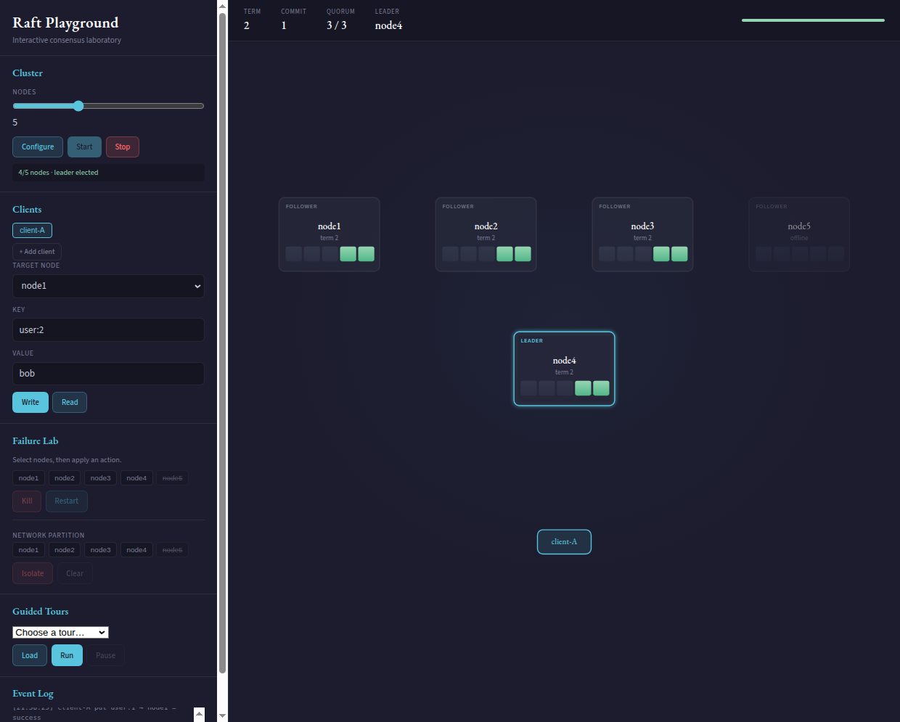
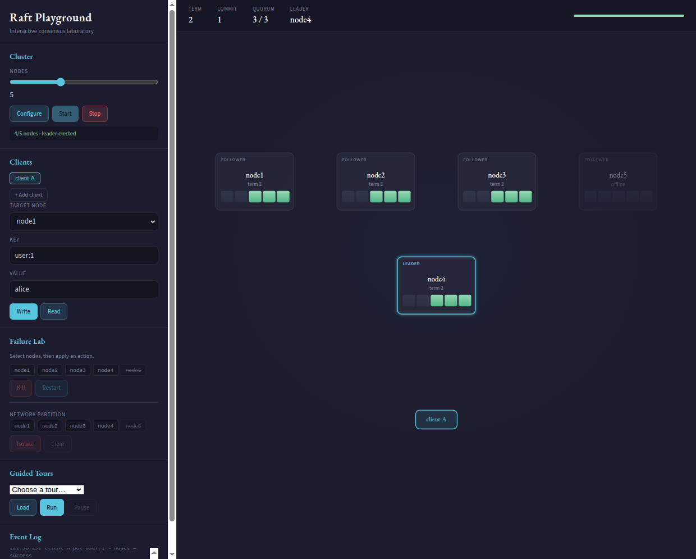
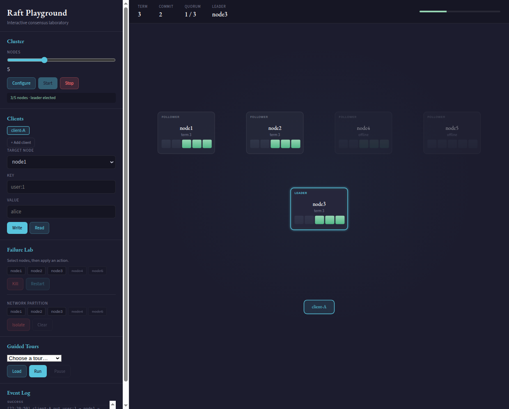

# Raft Playground

Go implementation of Raft with a browser UI on top. You start a real cluster, send writes, kill nodes, and watch elections and replication happen.

This is for learning, not production. The Raft code is tested (unit + integration) and benchmarked — details below.

## Try it

```bash
go run ./visualizer --no-browser --sandbox
```

Open http://localhost:8080. Pick a node count, click **Configure**, then **Start**.

Or run a scripted tour that drives the cluster for you:

```bash
go run ./visualizer --no-browser visualizer/scenarios/showcase.json
```

## What it looks like

Five nodes up, one leader elected:



Write `user:1 = alice` from the sidebar. The request goes to a node, gets forwarded if needed, and replicates:



Kill the leader in **Failure Lab**. The cluster picks a new one:



More screenshots and walkthroughs: [docs/playground.md](docs/playground.md)

## What you can do in the UI

- Start/stop a cluster (3–9 nodes)
- Send puts and gets from up to 3 clients
- Kill and restart individual nodes
- Isolate nodes to simulate a network partition
- Load guided tours (election, failure, partition, persistence)

## The Raft implementation

Leader election, log replication, disk persistence, recovery. Clients talk HTTP; nodes talk gRPC.

Not implemented: snapshots, dynamic membership.

Read the code: [docs/guide.md](docs/guide.md)

## Tests

```bash
go test -race ./core          # unit tests, no cluster
go test -v ./test             # 5-node integration tests
go test ./visualizer/...      # playground API
```

What each test covers: [docs/development/testing.md](docs/development/testing.md)

## Benchmarks

3-node cluster, single machine ([full report](benchmarks/REPORT.md)):

| | |
|---|---|
| Reads (peak) | ~72k ops/sec |
| Writes (64 clients) | ~19.5k ops/sec |
| Read p99 (16 clients) | ~1.3 ms |
| Write p99 (16 clients) | ~4 ms |
| Failover after leader crash | ~327 ms |

```bash
go run ./benchmarks
```

## Run nodes without the UI

```bash
go build -o ryanDB .

./ryanDB --id=node1 --port=8001 \
  --peers=node1=127.0.0.1:9001,node2=127.0.0.1:9002,node3=127.0.0.1:9003 \
  --reset=true
```

Start node2 and node3 on 8002/8003 with the same peers string. API: `/put?key=&value=`, `/get?key=`, `/status`.

## Repo layout

- `core/` — Raft
- `visualizer/` — playground UI + control server
- `test/` — integration tests
- `benchmarks/` — load tests
- `docs/` — guides and the screenshots above
