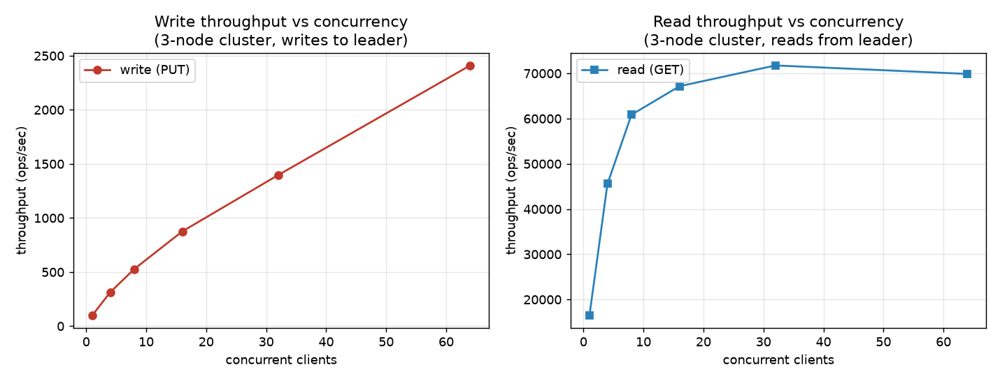
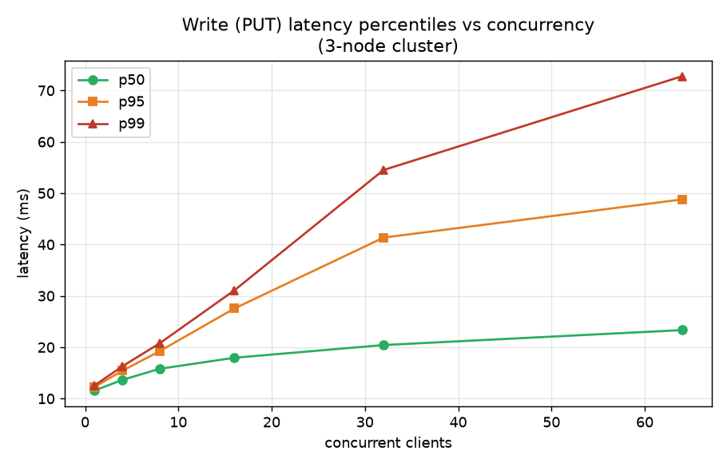
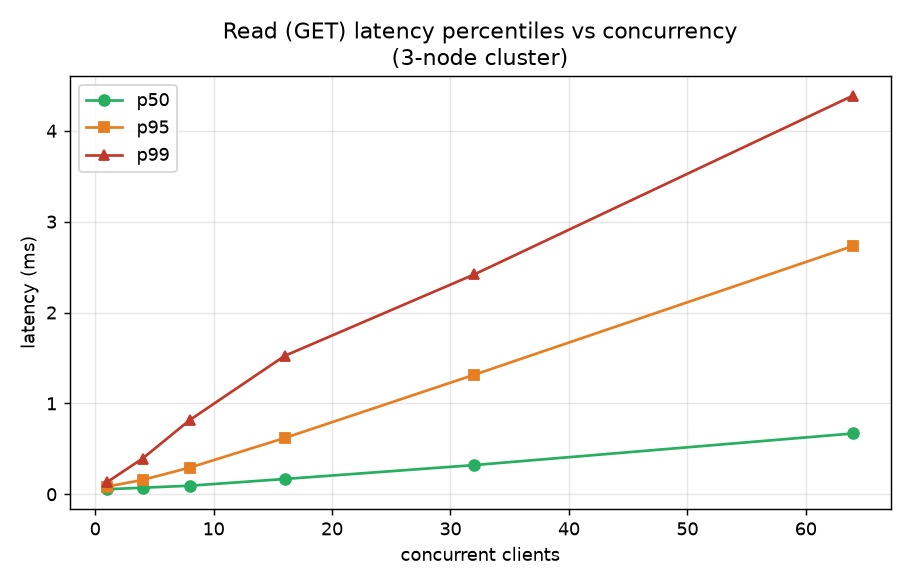
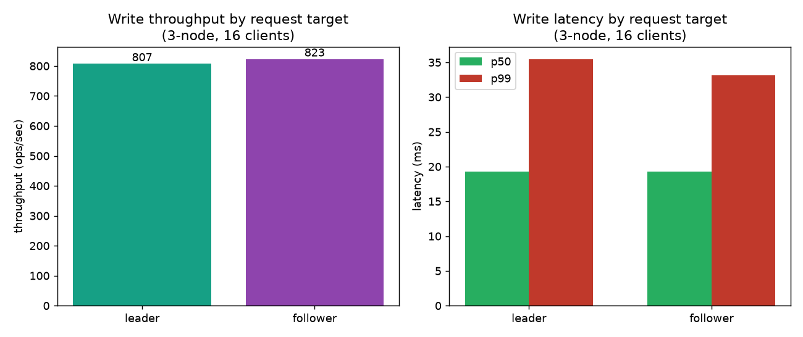
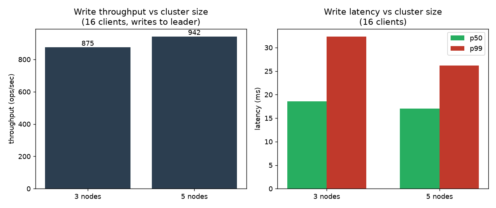
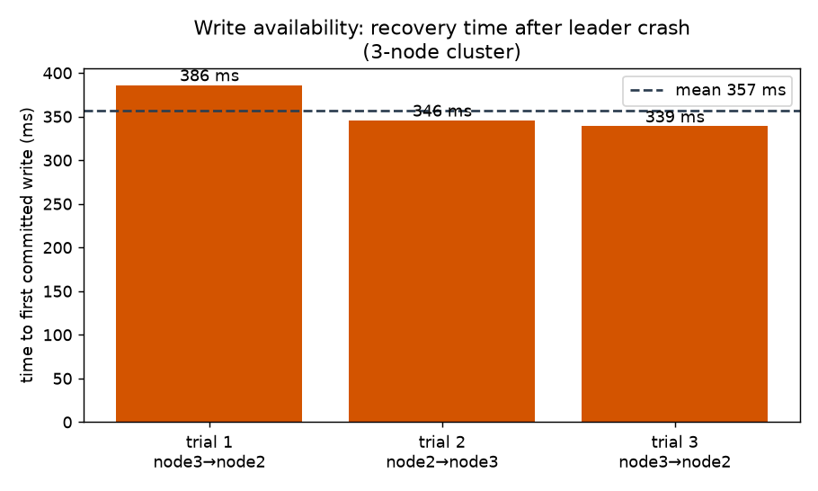

# Quorum Benchmark Report

Performance measurements for Quorum, the replicated in-memory key-value store in this repository. This report describes which metrics were chosen, how they were measured, and the results from a single-host test run.

Reproduce the run with `go run ./benchmarks` followed by `python3 benchmarks/plot.py`. See [`README.md`](README.md) for options.

---

## 1. Metrics and methodology

For a Raft-backed store, throughput and latency percentiles are the primary capacity metrics. Availability after leader failure matters for replicated systems. The table below lists each metric considered and whether it applies to Quorum.

| Metric | Included | Rationale |
|---|---|---|
| Throughput (ops/sec) | Yes | Writes and reads follow different paths (consensus vs in-memory lookup on the leader), so each is measured separately. |
| Latency percentiles (p50/p95/p99) | Yes | Percentiles are computed from the full set of per-request samples in each run window, not from averaged buckets. |
| Write vs read asymmetry | Yes | Writes incur replication and persistence; reads on the leader do not. |
| Concurrency scaling | Yes | Shows how throughput and latency change as concurrent clients increase. |
| Failover recovery time | Yes | Time from leader failure until writes succeed again. |
| Leader vs follower routing | Yes | Followers forward writes to the leader over gRPC; this measures any added cost. |
| Cluster size (3 vs 5 nodes) | Yes | Compares replication fan-out and quorum size at a fixed load. |
| Disk fsync isolation | Partial | Fsync is included in write latency but not measured in isolation. Group commit and deferred fsync batching reduce the per-write disk cost; the ~2 ms floor at concurrency 1 reflects batched persistence plus replication. |
| Scan / range queries | No | No scan API. |
| Consistency / staleness | No | Correctness is covered by the integration test suite (`test/`). |

**Load generation.** The harness uses closed-loop load: each of *N* worker goroutines sends one request, waits for the response, and repeats for a fixed duration. Throughput is completed operations divided by wall time; latency is the round-trip time per request. Closed-loop load tends to under-report tail latency compared with open-loop generators when the server slows down (see [Limitations](#6-limitations)).

**Other settings.** Each data point uses a 5 s measurement window after cluster warmup. Read benchmarks preload 2,000 keys. HTTP keep-alive and a large connection pool are enabled so results reflect store behavior rather than connection setup.

**Environment.** Single host (Cursor Cloud VM, 4 vCPUs, 16 GB RAM), all nodes as local processes, Go 1.24.0. Absolute numbers depend on the host; relative comparisons and order-of-magnitude gaps are the main portable results.

---

## 2. Throughput: reads vs writes

| Concurrency | Write ops/sec | Read ops/sec | Read / write ratio |
|---:|---:|---:|---:|
| 1 | 542 | 15,743 | 29 |
| 4 | 2,293 | 45,073 | 20 |
| 8 | 4,416 | 60,454 | 14 |
| 16 | 7,501 | 67,084 | 9 |
| 32 | 12,517 | 70,133 | 6 |
| 64 | 19,463 | 72,356 | 4 |

Write throughput increases with concurrency (542 to 19,463 ops/sec over the range tested). Group commit, deferred fsync, and tighter replication loops allow many in-flight writes to share disk sync and round-trip costs.

Read throughput is still higher than writes and levels off near 72k ops/sec between 32 and 64 clients, consistent with CPU or HTTP handling limits on a single host. The read/write ratio is much narrower than before write-path optimizations because write throughput improved dramatically.

---

## 3. Latency percentiles

### Writes (PUT, Raft commit path)

| Concurrency | p50 (ms) | p95 (ms) | p99 (ms) |
|---:|---:|---:|---:|
| 1 | 1.8 | 3.1 | 3.6 |
| 8 | 1.8 | 2.9 | 3.5 |
| 16 | 2.1 | 3.3 | 4.0 |
| 32 | 2.5 | 3.7 | 5.5 |
| 64 | 3.1 | 4.8 | 8.3 |

At concurrency 1, write latency has a floor of roughly 2 ms, down from the previous ~11 ms per-entry fsync floor. Median latency stays in the low single-digit milliseconds across the sweep; p99 reaches 8.3 ms at 64 clients.

### Reads (GET, leader in-memory path)

| Concurrency | p50 (ms) | p95 (ms) | p99 (ms) |
|---:|---:|---:|---:|
| 1 | 0.061 | 0.083 | 0.12 |
| 16 | 0.17 | 0.59 | 1.33 |
| 64 | 0.64 | 2.58 | 4.43 |

Reads remain sub-millisecond at low concurrency and stay in the low single-digit milliseconds at p99 under the loads tested. The read path does not run consensus or disk I/O.

---

## 4. Request routing: leader vs follower

| Target | Throughput (ops/sec) | p50 (ms) | p99 (ms) |
|---|---:|---:|---:|
| Leader (direct) | 7,673 | 2.0 | 4.1 |
| Follower (forwarded) | 6,796 | 2.3 | 5.6 |

Writes sent to a follower, which forwards to the leader over gRPC, are slightly slower than direct leader writes in this run (~11% lower throughput, modestly higher p99). The gap is still small on loopback compared with the overall commit path. This does not imply that leader discovery is unnecessary in production; it only characterizes this single-host setup.

---

## 5. Cluster size and failover

### Write performance vs cluster size

| Cluster size | Throughput (ops/sec) | p50 (ms) | p99 (ms) |
|---|---:|---:|---:|
| 3 nodes | 7,769 | 2.0 | 3.7 |
| 5 nodes | 7,592 | 2.1 | 3.9 |

At 16 concurrent clients writing to the leader, 3-node and 5-node clusters performed similarly; the 5-node run was slightly slower in this sample. The leader replicates to followers in parallel and only requires a majority of acknowledgments (2 of 3 vs 3 of 5), so two additional local followers did not add measurable cost on this host. Treat the difference as within measurement noise.

### Recovery after leader failure

| Trial | Leader change | Recovery (ms) |
|---|---|---:|
| 1 | node3 → node1 | 333 |
| 2 | node1 → node2 | 333 |
| 3 | node2 → node3 | 315 |
| Mean | | 327 |

The leader was killed during load. Recovery time is measured from the kill until a write to a surviving follower commits successfully. Mean recovery was 327 ms, which aligns with Quorum's randomized election timeout of 300–450 ms (see project README). No manual steps were required for the cluster to accept writes again.

---

## 6. Limitations

- **Single host.** All nodes share one machine; replication uses loopback networking. Real deployments would add inter-node RTT to write latency and failover time.
- **Closed-loop load.** When the server slows, clients slow with it, which can under-report tail latency compared with fixed-rate open-loop generators. Treat p99 as a lower bound under this harness.
- **Workload.** Small uniform values and unique keys only; no sweeps over payload size, key distribution, or mixed read/write ratios.
- **Sample size.** Cluster-size and routing comparisons use one concurrency level each.
- **Portability.** Re-run on the target environment for absolute figures.

---

## 7. Summary

| Observation | Result (this run) |
|---|---|
| Read vs write throughput | Reads peak near 72k ops/sec; writes reach ~19.5k ops/sec at 64 clients. |
| Write latency | ~2 ms floor at low load; p99 rises to ~8 ms at 64 clients. |
| Read latency | Sub-ms at low load; p99 under 5 ms at 64 clients. |
| Follower forwarding | Slightly slower than direct leader writes on loopback (~11% throughput gap). |
| 3 vs 5 nodes | Comparable write performance at 16 clients. |
| Failover | Mean write recovery ~327 ms after leader kill. |
