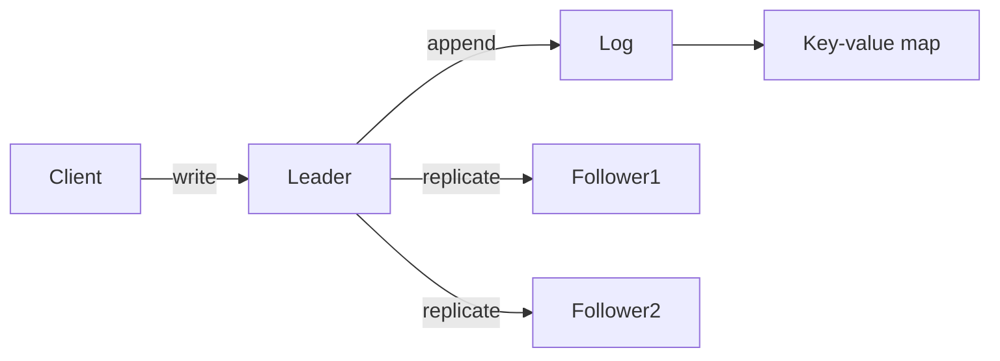
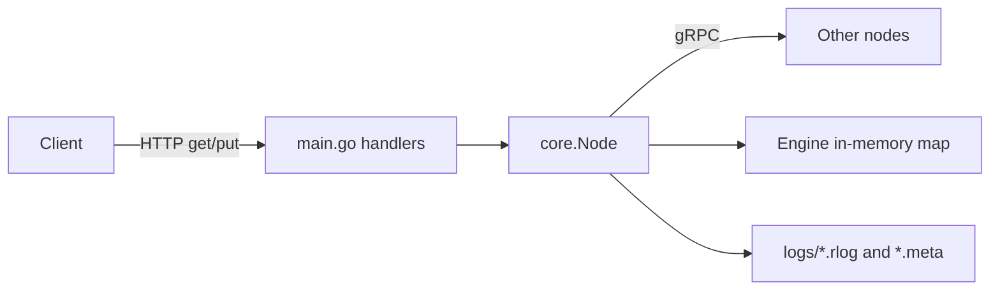
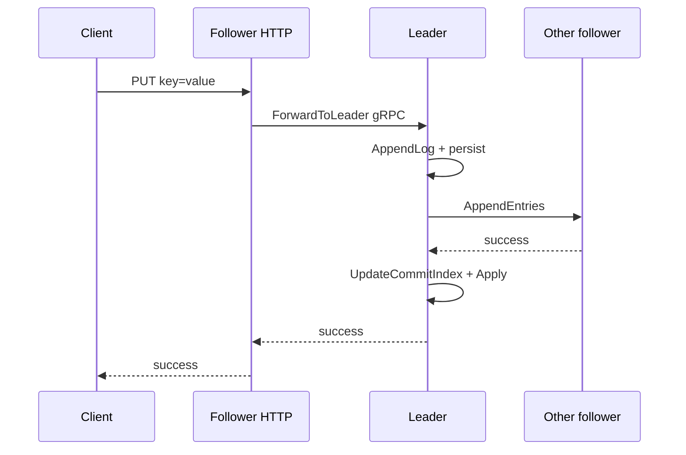

# RaftDB Beginner's Guide

This guide explains what Raft is, how this project implements it, and how to read the Go source. RaftDB is a learning project: it runs a real multi-node cluster, but it is not a production database.

After reading this, you should understand why a cluster needs a leader, what the log and commit index mean, and which files to open when you want to trace a write from HTTP to disk.

**Background assumed:** basic Go (structs, methods, goroutines) and familiarity with HTTP. No prior Raft knowledge required.

---

## The problem Raft solves

Imagine three servers that all store the same key-value data. A client sends `put foo=bar` to one server. If each server applied updates independently, they would drift apart after a network glitch or a crash. You need a rule that guarantees every server applies the **same commands in the same order**.

Raft solves this by electing a **leader**. All writes go through the leader first. The leader records each command in an append-only **log**, copies that log to other servers (**followers**), and only treats a command as final once a **majority** of servers have stored it. Followers replay the log in order into a **state machine**, a simple in-memory map.

If the leader dies, the cluster holds a new election and continues from the replicated log. That is the core idea: one authoritative sequence of operations, replicated before it is considered done.



---

## Raft concepts in this codebase

Raft papers use precise terms. This table maps each term to what it means in RaftDB and where it lives in code.

| Concept | Meaning in RaftDB | Where to look |
|---------|-------------------|---------------|
| **Term** | A monotonic election generation. Each election bumps the term. | `Node.Term` in `core/node.go` |
| **Leader / Follower / Candidate** | Roles a node can hold. Followers accept entries; candidates ask for votes; the leader replicates. | `NodeState` in `core/node.go` |
| **Log** | Ordered list of client commands (`put`, `get` metadata). Each entry has a term and a command. | `Node.Log`, `LogEntry` in `core/log.go` |
| **Commit** | An entry is committed once a majority of servers have stored it at the same index. | `CommitIndex`, `UpdateCommitIndex` in `core/leader.go` |
| **Apply** | Run a committed entry on the state machine (update the map). | `ApplyCommitted`, `Engine` in `core/storage.go` |

Two details matter for reading the code. **Commit** and **apply** are separate steps: an entry can be committed but not yet applied to the map. **Term** numbers increase on every election, even if no log entries change; they prevent stale leaders from making progress.

---

## System architecture

Each running process is one **node**. It exposes two network interfaces:

- **HTTP** on `--port`: what clients (and tests) call: `/get`, `/put`, `/status`, `/events`.
- **gRPC** on the address listed for this node in `--peers`: Raft traffic only: votes, log replication, and forwarding client commands to the leader.



The HTTP layer in `main.go` is thin: it parses query parameters, builds a `Command`, and calls `node.HandleCommand`. All consensus logic lives in `core/`. RPC message shapes are defined in `node.proto` and generated into `proto/nodepb/`.

A typical cluster starts three or more nodes with the same `--peers` string but different `--id` and HTTP ports. Integration tests use five nodes with HTTP on `8001–8005` and gRPC on `9001–9005`, using `127.0.0.1` addresses so Linux resolves peers consistently.

---

## End-to-end: a write (`put`)

Tracing one write shows how the pieces connect.

1. **HTTP entry.** A `GET /put?key=k&value=v` hits `put()` in `main.go`, which calls `HandleCommand` with a `put` command.

2. **Routing by role.** In `HandleCommand` (`core/node.go`), followers do not write locally. They call `ForwardToLeader`, which sends the command over gRPC to the current leader. Candidates return `"Error: election"`. Only the leader proceeds.

3. **Append to the log.** The leader calls `Commit` (`core/leader.go`), which first `AppendLog`s the command. That appends to the in-memory slice and persists via `Logger.AppendLog` (`core/log.go`) to `logs/<node-id>.rlog`.

4. **Replication.** When a node becomes leader, `StartReplicationWorkers` launches one goroutine per follower. Each loop in `ReplicateToFollower` sends `AppendEntries` RPCs (`core/rpc.go`) with new log entries and the current commit index. Followers append matching entries and reply success or failure; on failure the leader decrements `nextIndex` and retries.

5. **Commit.** After a follower acknowledges entries, the leader updates `matchIndex` and calls `UpdateCommitIndex`. An index becomes committed when a majority of servers have replicated it **and** the entry’s term equals the leader’s current term. The leader applies committed entries, then wakes any goroutines blocked in `Commit`.

6. **Response.** `Commit` returns only after the entry is both committed and applied to `Engine`. The HTTP handler returns `"success"`.



---

## End-to-end: a read (`get`)

Reads follow a similar path to the leader. A follower receiving `GET /get?key=k` forwards the command to the leader via `ForwardToLeader`, same as a write.

On the leader, `Get` (`core/node.go`) waits until `LastApplied` catches up to `CommitIndex` so the read sees applied state, then reads from `Engine.Get` (`core/storage.go`). This is a simplified read path: it does not implement the full Raft read-index optimization used in production systems like etcd. For learning purposes it is enough to see that reads on the leader go through the applied map after commit.

---

## Leader election

Every follower runs an election timer (`StartElectionTimer` in `core/node.go`). If the timer fires and the node is still a follower, it becomes a **candidate**, increments its term, votes for itself, and sends `RequestVote` RPCs to every other node.

A follower grants a vote if the candidate’s log is at least as up-to-date as its own and it has not voted for someone else in this term. If the candidate receives votes from a **majority**, it becomes leader and starts replication workers.

While a leader is healthy, it sends periodic `AppendEntries` heartbeats (often with zero new entries). Each heartbeat calls `ReceiveHeartbeat`, which resets the follower’s election timer. Timeouts are randomized between 300 ms and 450 ms so two followers rarely start elections at the same moment, a simple way to reduce split votes.

If the leader stops, timers expire, a new leader is elected, and replication continues from the shared log. The `/status` endpoint exposes `state` (0=follower, 1=candidate, 2=leader), `term`, and `leaderId` for debugging.

---

## Persistence and recovery

Each node persists two kinds of data under `logs/`:

- **`<id>.rlog`**: append-only log entries (term + command).
- **`<id>.meta`**: current term and who this node voted for.

On startup with `--reset=false`, `RecoverState` reloads the log and metadata, replays entries into the in-memory map, and rejoins the cluster. With `--reset=true`, files are truncated for a fresh cluster.

Integration tests in `test/` start real subprocesses, kill nodes, restart them, and verify data survives. Unit tests in `core/node_test.go` cover commit, apply, voting, and log persistence without starting a cluster.

---

## Go patterns you will see

RaftDB uses standard Go concurrency tools. You do not need to master all of them before reading, but recognizing them helps.

**Goroutines** run the election timer loop and one replication worker per follower. They share the `Node` struct with HTTP handlers and gRPC callbacks, so access to shared fields must be coordinated.

**`sync.Mutex`** protects the log slice (`LogMu`) and apply logic (`ApplyMu`). **`sync.Cond`** lets `Commit` and `Get` block until commit or apply indices advance, then wake when `Broadcast` is called.

**`atomic` types** store term, commit index, last applied index, and pointer strings like leader id so HTTP handlers can read status without holding the log mutex for long.

**gRPC** handles node-to-node RPCs. `node.proto` defines the service; `protoc` generates `proto/nodepb/node.pb.go` and `node_grpc.pb.go`. The server implementation is the `server` type in `core/rpc.go`.

---

## Suggested reading order

Read in this order the first time you walk through the source. Allow 30–45 minutes.

1. **`main.go`**: Flags, HTTP handlers, how a node is created and initialized.
2. **`core/node.go`**: The `Node` struct, roles, `HandleCommand`, election timer, `ForwardToLeader`, apply and get.
3. **`core/leader.go`**: `AppendLog`, `Commit`, `ReplicateToFollower`, `UpdateCommitIndex`.
4. **`core/rpc.go`**: `AppendEntries` and `RequestVote` handlers; where followers accept replicated data.
5. **`core/log.go`** and **`core/storage.go`**: Persistence format and the key-value state machine.
6. **`core/node_test.go`**: Short tests that show commit/apply and voting rules in isolation.
7. **`test/integration_test.go`**: Full cluster scenarios: election, replication, persistence, partitions.

Optional after that: `visualizer/` for a browser animation of scripted scenarios, and `benchmarks/` for throughput and latency numbers.

---

## How to explore

**Run a cluster.** Build and start three nodes as shown in the [README](../README.md). Send writes to any node; reads and writes reach the leader automatically.

**Integration tests.**

```bash
go test -v ./test
```

**Unit tests (fast, no subprocesses).**

```bash
go test -v ./core
```

**Visualizer demo.**

```bash
go run ./visualizer visualizer/scenarios/showcase.json
```

Opens a browser animation of boot, writes, leader failure, and recovery. See [visualizer/README.md](../visualizer/README.md) for other scenarios.

---

## What this project does not implement

RaftDB deliberately stops where a production system would keep going:

- **Log compaction / snapshots**: the log grows forever on disk.
- **Dynamic membership**: peer list is fixed at startup.
- **Full linearizable reads**: reads use a simplified leader-based path.

For performance numbers on a single machine, see [benchmarks/REPORT.md](../benchmarks/REPORT.md). That report is optional context, not required for understanding the code.

---

## Further reading

- [The Raft paper](https://raft.github.io/raft.pdf): the authoritative specification.
- [raft.github.io](https://raft.github.io): paper, slides, and the original animated explanations.
- [README](../README.md): quick commands for running a cluster and calling the HTTP API.
