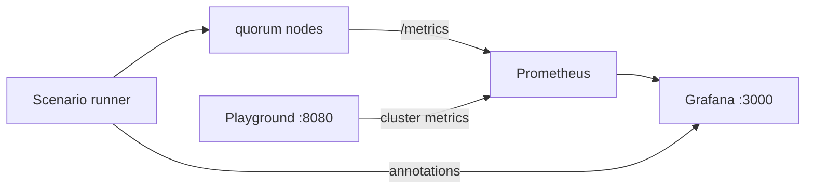

# Observability Guide

Reference for metrics, PromQL queries, Grafana panels, and alerts when monitoring a live Raft cluster with quorum.

## Architecture



Each node exposes Prometheus metrics at `/metrics`. The playground aggregates cluster-level metrics and drives scenario load. Grafana is optional.

---

## A. Machine / node state

| Metric | Type | Labels | Meaning | Visualization |
|---|---|---|---|---|
| `quorum_state` | Gauge | `node` | 0=follower, 1=candidate, 2=leader | Stat panel or state timeline per node |
| `quorum_is_leader` | Gauge | `node` | 1 if leader | Leader identity stat with threshold coloring |
| `quorum_term` | Gauge | `node` | Current Raft term | Time series; spikes indicate elections |
| `quorum_commit_index` | Gauge | `node` | Highest committed log index | Multi-series line; converging lines = healthy replication |
| `quorum_last_applied` | Gauge | `node` | Highest applied log index | Line chart per node |
| `quorum_apply_lag` | Gauge | `node` | `commit_index - last_applied` | Line; sustained lag = slow apply loop |
| `quorum_log_length` | Gauge | `node` | Number of log entries | Line; divergence hints replication issues |
| `up{job="quorum"}` | Gauge | `instance` | Scrape success | Node up/down table |

**Useful PromQL**

```promql
# Current leader
max by (node) (quorum_is_leader == 1)

# Cluster commit spread
max(quorum_commit_index) - min(quorum_commit_index)

# Apply lag per node
quorum_commit_index - quorum_last_applied
# or use quorum_apply_lag directly
```

---

## B. Replication health (cluster-level)

| Metric | Type | Labels | Source | Visualization |
|---|---|---|---|---|
| `quorum_replication_lag` | Gauge | `node` | Playground | Line; spikes during load or partition |
| `quorum_leader_count` | Gauge | - | Playground | Stat; alert when `!= 1` |
| `quorum_cluster_nodes` | Gauge | - | Playground | Configured cluster size |
| `quorum_nodes_running` | Gauge | - | Playground | Processes currently up |

**Useful PromQL**

```promql
# Split brain or no leader
quorum_leader_count

# Worst follower lag
max(quorum_replication_lag)

# Nodes reachable by Prometheus
count(up{job="quorum"} == 1)
```

---

## C. Event rates (counters)

| Metric | Type | Labels | Meaning | Visualization |
|---|---|---|---|---|
| `quorum_elections_total` | Counter | `node` | Elections started | `rate(...[1m])` bar gauge |
| `quorum_commits_total` | Counter | `node` | Commits as leader | `rate(...[1m])` line during load |
| `quorum_append_entries_total` | Counter | `node`, `result` | AppendEntries outcomes | Stacked area by result |
| `quorum_requestvote_total` | Counter | `node`, `result` | Vote RPC outcomes | Line by result |

**Useful PromQL**

```promql
rate(quorum_elections_total[1m])
rate(quorum_commits_total[1m])
rate(quorum_append_entries_total{result="success"}[1m])
rate(quorum_append_entries_total{result="failure"}[1m])
rate(quorum_append_entries_total{result="error"}[1m])
rate(quorum_requestvote_total{result="granted"}[1m])
```

---

## D. Client / workload

| Metric | Type | Labels | Meaning | Visualization |
|---|---|---|---|---|
| `quorum_client_requests_total` | Counter | `op`, `result`, `node` | HTTP put/get volume | Rate by op and result |
| `quorum_client_request_duration_seconds` | Histogram | `op`, `node` | Request latency | Heatmap or p50/p99 |
| `quorum_scenario_step` | Gauge | `scenario` | Current step index | Stat panel |
| `quorum_scenario_running` | Gauge | — | 1 if scenario active | Stat panel |

**Useful PromQL**

```promql
sum by (op) (rate(quorum_client_requests_total[1m]))
histogram_quantile(0.99, sum by (le, op) (rate(quorum_client_request_duration_seconds_bucket[5m])))
```

---

## E. Recommended Grafana dashboard layout

### Row 1: Cluster health

- **Leader count** — `quorum_leader_count` (threshold: green=1, red otherwise)
- **Current term** — `max(quorum_term)`
- **Nodes running** — `quorum_nodes_running / quorum_cluster_nodes`
- **Commit spread** — `max(quorum_commit_index) - min(quorum_commit_index)`

### Row 2: Consensus and replication

- **Commit index by node** — `quorum_commit_index`
- **Replication lag by node** — `quorum_replication_lag`
- **Apply lag by node** — `quorum_apply_lag`

### Row 3: Activity and stability

- **Election rate** — `rate(quorum_elections_total[1m])`
- **Commit rate** — `rate(quorum_commits_total[1m])`
- **AppendEntries success vs failure** — rates by `result`

### Row 4: Scenario context

- **Scenario step** — `quorum_scenario_step`
- **Scenario running** — `quorum_scenario_running`
- **Annotations**: kill, partition, load bursts marked by the playground

### Row 5: Node table

| Column | Query |
|---|---|
| Node | label `node` |
| Role | `quorum_state` |
| Term | `quorum_term` |
| Commit | `quorum_commit_index` |
| Lag | `quorum_replication_lag` |
| Up | `up{job="quorum"}` |

---

## F. Alert rules (reference)

| Alert | Expression | Duration | Meaning |
|---|---|---|---|
| NoSingleLeader | `quorum_leader_count != 1` | 10s | Split brain or election in progress |
| HighReplicationLag | `max(quorum_replication_lag) > 5` | 30s | Follower stuck behind leader |
| NodeDown | `up{job="quorum"} == 0` | 15s | Node process killed or unreachable |
| ElectionStorm | `sum(rate(quorum_elections_total[5m])) > 0.5` | 2m | Unstable cluster |

---

## G. Scenario demos

| Scenario | What to watch |
|---|---|
| `steady-writes.json` | Commit rate rises; lag stays near zero |
| `leader-failure.json` | Term spike, election rate bump, brief lag |
| `partition.json` | Lag on minority; append failures rise |
| `recovery.json` | Lag decays after partition heal |

---

## H. Startup

**Prerequisite:** Docker Desktop must be running.

```bash
go run ./playground
```

Single command: starts Prometheus, boots a 5-node cluster, runs `full-demo.json`, opens the browser with metrics charts.

Live metrics API: `GET /api/metrics/live` (write/read throughput, p99 latency, replication lag, failover ms).

- Demo UI: http://localhost:8080
- Prometheus (proxied): http://localhost:8080/prometheus/

Disable per-node metrics when running quorum manually: `--metrics=false`.
