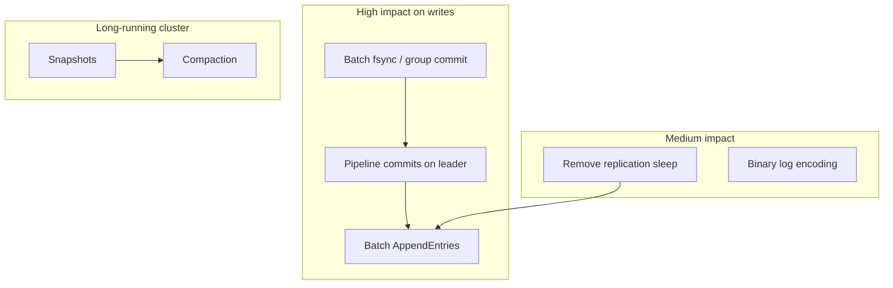

# Performance improvement opportunities

This document outlines realistic ways to improve RaftDB throughput and latency. It is based on the current implementation, the [benchmark report](../benchmarks/REPORT.md), and common practice in production Raft systems (etcd, TiKV, CockroachDB).

RaftDB is an educational project. Many of these changes add complexity or weaken durability guarantees. They are listed here as a roadmap, not as a mandate to turn this into a production database.

---

## Current baseline

On a single host with a 3-node cluster (see the benchmark report for full numbers):

| Path | Throughput (approx.) | Dominant cost |
|---|---|---|
| Writes | ~2.4k ops/sec at 64 clients | Consensus, replication, disk sync |
| Reads (leader) | ~70k ops/sec | HTTP + in-memory map lookup |
| Failover | ~357 ms | Election timeout (300–450 ms) |

Writes are roughly 30–170× slower than reads. That gap is expected: every write goes through Raft and is persisted to disk before the client receives success. Reads on the leader skip consensus and disk.

The sections below follow the write path first, since that is where most gain is available.

---

## 1. Persistence and the write latency floor

### What the code does today

Each log append in [`core/log.go`](../core/log.go) calls `logFile.Sync()` after writing an entry. That forces the operating system to flush data to stable storage on every write. The benchmark report shows an ~11 ms floor at concurrency 1, which is consistent with per-entry fsync on typical hardware.

### Possible improvements

**Batch persistence.** Buffer several log entries in memory and call `Sync()` once per batch (group commit). This is how many databases amortize disk cost. Trade-off: a crash may lose the un-synced tail of the batch unless you accept weaker durability or use battery-backed storage.

**Separate append and sync.** Append entries quickly, sync on a timer or when a byte/time threshold is reached. Requires careful recovery logic so replay after crash does not double-apply or miss entries.

**Optional durability modes.** Expose a flag (e.g. `--sync=always|batch|none`) for experiments. `always` matches current behavior; `batch` improves benchmarks; `none` is useful only for load testing without caring about crash safety.

**Faster on-disk format.** Entries are JSON with a length prefix. A fixed-width or protobuf encoding would reduce CPU and bytes written, but fsync latency usually dominates until batching is in place.

| Change | Expected impact | Complexity | Durability impact |
|---|---|---|---|
| Group commit (batch fsync) | High on write latency floor | Medium | Configurable |
| Async / delayed fsync | High | High | Weaker unless bounded |
| Binary log encoding | Low to medium | Medium | None |

---

## 2. Replication and the Raft leader

### What the code does today

The leader in [`core/leader.go`](../core/leader.go):

- Appends one client command per log entry.
- Runs one goroutine per follower in `ReplicateToFollower`.
- Sends `AppendEntries` with all pending entries for that follower, then sleeps 10 ms before the next round.
- Blocks the client in `Commit()` until the entry is replicated to a majority and applied.

JSON marshaling happens when building RPC payloads and again when persisting entries. Followers deserialize on receive.

### Possible improvements

**Remove or reduce the replication sleep.** The fixed 10 ms sleep caps how often each follower is contacted. Replacing it with immediate retry on failure, or a short backoff only after errors, would increase replication throughput under load.

**Batch client writes into fewer log entries.** A leader-side write buffer could combine multiple `put` requests into one `AppendEntries` round trip. Throughput scales with batch size until disk or network limits apply.

**Pipeline commits on the leader.** Today one HTTP handler blocks in `Commit()` until its entry is done. Allowing multiple in-flight appends (each waiting on its own index) lets the leader accept new requests while earlier entries replicate. The state machine still applies in order.

**Serialize once.** Store commands in the log in the same encoding used on the wire (protobuf bytes) to avoid JSON marshal/unmarshal on every replication step.

**Parallel append to disk and network.** Persist locally and send to followers concurrently where safe, rather than strictly serializing append-then-replicate for each entry.

**Tune RPC timeouts.** AppendEntries uses a 200 ms timeout. On LAN this is fine; on WAN, adaptive timeouts reduce false retries. On loopback, shorter timeouts with faster retry may reduce tail latency.

| Change | Expected impact | Complexity |
|---|---|---|
| Remove 10 ms replication sleep | Medium to high write throughput | Low |
| Leader write batching | High write throughput | Medium |
| Pipelined in-flight commits | High under concurrent clients | Medium |
| Single encoding for log + RPC | Low to medium CPU | Medium |

---

## 3. Read path

### What the code does today

Reads on the leader wait until `LastApplied` catches up to `CommitIndex`, then read from an in-memory map ([`core/node.go`](../core/node.go)). Followers forward reads to the leader over gRPC. There is no read index, lease, or follower-local read optimization.

Benchmarks already show reads near 70k ops/sec on one machine. Further gains are possible but secondary to write improvements.

### Possible improvements

**Serve reads from followers (relaxed consistency).** Followers could read their local map without forwarding if the application accepts stale reads. Large read-heavy workloads benefit; linearizability is lost unless combined with read-index or lease mechanisms.

**Read index (linearizable follower reads).** Before serving a read, a follower confirms with the leader that it is still safe to read at its current commit index. Adds one round trip but spreads read load without stale data.

**Leader read leases.** The leader grants a short lease during which it assumes it is still leader; reads skip some synchronization. Common in etcd-style systems; must tie into election safety.

**Skip work on the hot path.** `/status` and `/events` are useful for debugging but add work if called frequently. A production mode could disable event recording on client requests ([`main.go`](../main.go)).

**Alternative client protocol.** HTTP with query parameters is simple but not optimal. gRPC or a binary HTTP API would reduce parsing overhead; expect modest gains compared with consensus cost on writes.

| Change | Expected impact | Complexity | Consistency |
|---|---|---|---|
| Follower reads (stale) | High read throughput | Low | Relaxed |
| Read index | Medium read throughput | High | Linearizable |
| Disable debug events in prod | Low | Low | None |

---

## 4. Log growth and recovery

### What is missing today

The README lists log compaction and snapshots as not implemented. The log grows without bound on disk and in memory.

### Why it matters for performance

Performance is fine for short benchmarks. Long-running clusters pay for:

- Larger replication messages when followers catch up.
- Slower restart and recovery as [`RecoverState`](../core/node.go) replays the full log.
- More disk I/O over time.

### Possible improvements

**Snapshotting.** Periodically compact applied entries into a snapshot; followers install snapshots when far behind. Standard Raft extension; significant implementation effort.

**Truncation after snapshot.** Drop log prefixes that are covered by the latest snapshot. Keeps memory and disk bounded.

**Segmented log files.** Rotate `.rlog` files by size or time so compaction and fsync operate on smaller units.

These changes improve steady-state and recovery more than peak ops/sec on a fresh cluster, but they are required for any long-lived deployment.

---

## 5. Client and cluster usage

Not all performance work belongs inside the node process.

**Leader-aware clients.** Benchmarks show follower forwarding is cheap on loopback, but on a real network, clients that discover and prefer the leader avoid an extra hop and reduce load on followers.

**Write batching at the application.** Sending fewer, larger logical updates (or a batch API) maps directly to fewer Raft entries.

**Right-size the cluster.** Benchmarks showed similar write performance at 3 and 5 nodes on one host. On a wide-area network, more nodes mean more replication RTT to reach a majority. Use the minimum replication factor that meets availability goals.

**Hardware and placement.** SSD vs HDD, co-locating nodes in the same AZ vs spreading them for fault tolerance, and network latency dominate once software batching is in place.

---

## 6. Suggested priority

A practical order if the goal is measurable improvement without rewriting Raft:

1. **Group commit / batched fsync** (addresses the ~11 ms write floor).
2. **Remove replication sleep and pipeline leader commits** (better throughput under concurrent writers).
3. **Batch entries in AppendEntries** (fewer round trips per unit of work).
4. **Single wire format for log and RPC** (lower CPU).
5. **Read path optimizations** (only if read load or leader CPU becomes the bottleneck).
6. **Snapshots and compaction** (required for long-running clusters, less for benchmark peaks).



---

## 7. Measuring changes

Any change should be validated with:

```bash
go test -count=1 ./core ./test
go run ./benchmarks
python3 benchmarks/plot.py
```

Compare write p50/p99 and throughput before and after. For persistence changes, run [`TestLogPersistence`](../test/integration_test.go) and kill-power tests to confirm recovery behavior still matches the durability level you intend to provide.

Document new flags or durability modes in the README and update the benchmark report when defaults change.

---

## 8. Further reading

- [Raft paper](https://raft.github.io/raft.pdf): Sections on log compaction and safety.
- [etcd performance](https://etcd.io/docs/latest/op-guide/performance/): Operational tuning for a production Raft store.
- [Benchmark report](../benchmarks/REPORT.md): Current numbers and methodology.
- [Beginner's guide](./guide.md): How the write and read paths work today.
