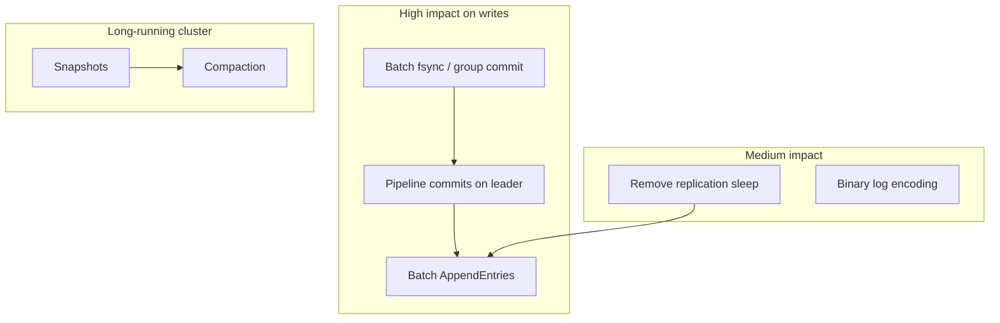

# Performance improvement opportunities

This document outlines realistic ways to improve Quorum throughput and latency. It is based on the current implementation, the [benchmark report](../benchmarks/REPORT.md), and common practice in production Raft systems (etcd, TiKV, CockroachDB).

Quorum is an educational project. Many of these changes add complexity or weaken durability guarantees. They are listed here as a roadmap, not as a mandate to turn this into a production database.

Status legend used throughout this document:

- **[done]** implemented and benchmarked; see [OPTIMIZATIONS.md](../OPTIMIZATIONS.md) for measured results.
- **[planned]** not yet implemented; described here as a roadmap item.

Already implemented on the write path: group commit / batched fsync, a single fsync per batch (deduplicated across replicators), removing the per-round replication sleep, waking replicators immediately on append, caching the serialized form of each log entry so it is marshaled once, removing the post-mismatch replication backoff, and bounding `AppendEntries` payloads so a far-behind follower catches up in steady batches. The remaining items below are the genuinely outstanding work.

---

## Current baseline

On a single host with a 3-node cluster (see the benchmark report for full numbers):

| Path | Throughput (approx.) | Dominant cost |
|---|---|---|
| Writes | ~28k ops/sec at 64 clients | Consensus, replication, disk sync |
| Reads (leader) | ~94k ops/sec | HTTP + in-memory map lookup |
| Failover | ~1.4 s | Election timeout (600–1000 ms) |

Writes are roughly 3–12× slower than reads, depending on concurrency. That gap is expected: every write goes through Raft and is persisted to disk before the client receives success. Reads on the leader skip consensus and disk. (Before the write-path optimization campaign, writes were far slower — ~2.4k ops/sec at 64 clients; see [OPTIMIZATIONS.md](../OPTIMIZATIONS.md).)

The sections below follow the write path first, since that is where most gain is available.

---

## 1. Persistence and the write latency floor

### What the code does today

Log appends in [`core/log.go`](../core/log.go) are persisted with `fsync` before an entry is acknowledged. The original implementation called `logFile.Sync()` on every single append, which forced the operating system to flush to stable storage on every write — an ~11 ms latency floor at concurrency 1 on the original benchmark host, consistent with per-entry fsync. Group commit (now implemented — **[done]**, below) batches that into one `Sync()` per replication round, which is what the code does today.

### Possible improvements

**Batch persistence. [done]** Buffer several log entries in memory and call `Sync()` once per batch (group commit). This is how many databases amortize disk cost. Trade-off: a crash may lose the un-synced tail of the batch unless you accept weaker durability or use battery-backed storage. Quorum buffers writes and fsyncs once per replication batch, deduplicating the sync across follower replicators with a `dirty` flag.

**Separate append and sync.** Append entries quickly, sync on a timer or when a byte/time threshold is reached. Requires careful recovery logic so replay after crash does not double-apply or miss entries.

**Optional durability modes.** Expose a flag (e.g. `--sync=always|batch|none`) for experiments. `always` matches current behavior; `batch` improves benchmarks; `none` is useful only for load testing without caring about crash safety.

**Faster on-disk format.** Entries are JSON with a length prefix. A fixed-width or protobuf encoding would reduce CPU and bytes written, but fsync latency usually dominates until batching is in place.

| Change | Expected impact | Complexity | Durability impact |
|---|---|---|---|
| Group commit (batch fsync) **[done]** | High on write latency floor | Medium | Configurable |
| Async / delayed fsync | High | High | Weaker unless bounded |
| Binary log encoding | Low to medium | Medium | None |

---

## 2. Replication and the Raft leader

### What the code does today

The leader in [`core/leader.go`](../core/leader.go):

- Appends one client command per log entry.
- Runs one goroutine per follower in `ReplicateToFollower`.
- Sends `AppendEntries` with the pending entries for that follower (bounded by `maxEntriesPerAppend`), and only blocks on the idle path: when there is nothing to send it waits on `ReplicateNotify` or a short heartbeat timer, so a new append wakes it immediately.
- Blocks the client in `Commit()` until the entry is replicated to a majority and applied. Each client request runs in its own goroutine, so many appends are in flight at once.

Each entry caches its serialized command (`LogEntry.Serialized`) so it is JSON-marshaled once at append time and reused for every replication RPC.

### Possible improvements

**Remove or reduce the replication sleep. [done]** The old fixed per-round sleep capped how often each follower was contacted. Replicators now sleep only when idle (no pending entries) and wake immediately on the next append.

**Wake replicators on append. [done]** `notifyReplicators` signals idle follower goroutines as soon as a new entry is appended, instead of waiting for the next timer tick.

**Serialize once. [done]** Commands are marshaled a single time and cached on the log entry, avoiding repeated JSON encoding on every replication step.

**Batch client writes into fewer log entries.** A leader-side write buffer could combine multiple `put` requests into one `AppendEntries` round trip. Throughput scales with batch size until disk or network limits apply.

**Pipeline commits on the leader. [planned]** Today the fsync and the replication RPC sit in series on each replicator's hot path, and commit waiters are woken with a broadcast condition variable. Decoupling persistence (a dedicated fsync pipeline that publishes a durable index) from replication, and replacing the broadcast wakeups with targeted notification, lets disk and network progress in parallel and removes per-commit lock contention.

**Parallel append to disk and network. [planned]** Persist locally and send to followers concurrently where safe, rather than fsyncing before each replication send.

**Tune RPC timeouts.** AppendEntries uses a 300 ms timeout. On LAN this is fine; on WAN, adaptive timeouts reduce false retries. On loopback, shorter timeouts with faster retry may reduce tail latency.

| Change | Expected impact | Complexity |
|---|---|---|
| Remove per-round replication sleep **[done]** | Medium to high write throughput | Low |
| Bounded `AppendEntries` batches **[done]** | Reliable follower catch-up | Low |
| Single encoding for log + RPC **[done]** | Low to medium CPU | Medium |
| Leader write batching | High write throughput | Medium |
| Pipelined in-flight commits | High under concurrent clients | Medium |

---

## 3. Read path

### What the code does today

Reads on the leader wait until `LastApplied` catches up to `CommitIndex`, then read from an in-memory map ([`core/node.go`](../core/node.go)). Followers forward reads to the leader over gRPC. There is no read index, lease, or follower-local read optimization.

Benchmarks already show reads near 94k ops/sec on one machine. Further gains are possible but secondary to write improvements.

### Possible improvements

**Serve reads from followers (relaxed consistency).** Followers could read their local map without forwarding if the application accepts stale reads. Large read-heavy workloads benefit; linearizability is lost unless combined with read-index or lease mechanisms.

**Read index (linearizable follower reads).** Before serving a read, a follower confirms with the leader that it is still safe to read at its current commit index. Adds one round trip but spreads read load without stale data.

**Leader read leases.** The leader grants a short lease during which it assumes it is still leader; reads skip some synchronization. Common in etcd-style systems; must tie into election safety.

**Skip work on the hot path.** `/status` and `/events` are useful for debugging but add work if called frequently. A production mode could disable event recording on client requests ([`main.go`](../main.go)).

**Alternative client protocol.** HTTP with query parameters is simple but not optimal. gRPC or a binary HTTP API would reduce parsing overhead; expect modest gains compared with consensus cost on writes.

| Change | Expected impact | Complexity | Consistency |
|---|---|---|---|
| Follower reads (stale) | High read throughput | Low | Relaxed |
| Read index | Medium read throughput | High | Linearizable |
| Disable debug events in prod | Low | Low | None |

---

## 4. Log growth and recovery **[done]**

### What was missing

Originally the log grew without bound on disk and in memory; there was no compaction or snapshotting. Long-running clusters paid for it with larger catch-up messages, slower restart (as [`RecoverState`](../core/node.go) replayed the full log), and ever-growing disk I/O.

### What is implemented

**Snapshotting. [done]** A background compactor folds the applied prefix of the log into a state-machine snapshot once enough entries accumulate beyond the previous snapshot (`SnapshotThreshold`). See [`core/snapshot.go`](../core/snapshot.go).

**Truncation after snapshot. [done]** The covered log prefix is dropped from memory and rewritten on disk; indices are tracked in absolute terms and remapped to the retained tail via `SnapshotIndex`. Recovery loads the snapshot and replays only the tail.

**Install snapshot on lagging followers. [done]** A new `InstallSnapshot` RPC lets the leader ship a snapshot to any follower whose `nextIndex` has fallen below the compacted prefix, instead of being unable to serve the missing entries.

These keep memory and disk bounded for long-lived deployments. On a 40,000-write / 500-key workload the on-disk log shrank ~30× (5.5 MB → 187 KB) and restart recovery roughly halved; see [OPTIMIZATIONS.md](../OPTIMIZATIONS.md). They improve steady-state and recovery rather than peak ops/sec on a fresh cluster.

**Segmented log files. [planned]** Rotating `.rlog` files by size or time (so compaction and fsync operate on smaller units) is still future work; compaction currently rewrites a single log file.

---

## 5. Client and cluster usage

Not all performance work belongs inside the node process.

**Leader-aware clients.** Benchmarks show follower forwarding is cheap on loopback, but on a real network, clients that discover and prefer the leader avoid an extra hop and reduce load on followers.

**Write batching at the application.** Sending fewer, larger logical updates (or a batch API) maps directly to fewer Raft entries.

**Right-size the cluster.** Benchmarks showed similar write performance at 3 and 5 nodes on one host. On a wide-area network, more nodes mean more replication RTT to reach a majority. Use the minimum replication factor that meets availability goals.

**Hardware and placement.** SSD vs HDD, co-locating nodes in the same AZ vs spreading them for fault tolerance, and network latency dominate once software batching is in place.

---

## 6. Suggested priority

A practical order if the goal is measurable improvement without rewriting Raft:

1. **Group commit / batched fsync** **[done]** (addresses the write latency floor).
2. **Remove replication sleep** **[done]** and **pipeline leader commits** **[planned]** (better throughput under concurrent writers).
3. **Batch entries in AppendEntries** **[done]** (fewer round trips per unit of work).
4. **Single wire format for log and RPC** (lower CPU; entries are already serialized once and cached).
5. **Read path optimizations** (only if read load or leader CPU becomes the bottleneck).
6. **Snapshots and compaction** **[done]** (required for long-running clusters, less for benchmark peaks).



---

## 7. Measuring changes

Any change should be validated with:

```bash
go test -count=1 ./core ./test
go run ./benchmarks
python3 benchmarks/plot.py
```

Compare write p50/p99 and throughput before and after. For persistence changes, run [`TestLogPersistence`](../test/integration_test.go) and kill-power tests to confirm recovery behavior still matches the durability level you intend to provide.

Document new flags or durability modes in the README and update the benchmark report when defaults change.

---

## 8. Further reading

- [Raft paper](https://raft.github.io/raft.pdf): Sections on log compaction and safety.
- [etcd performance](https://etcd.io/docs/latest/op-guide/performance/): Operational tuning for a production Raft store.
- [Benchmark report](../benchmarks/REPORT.md): Current numbers and methodology.
- [Beginner's guide](./guide.md): How the write and read paths work today.
